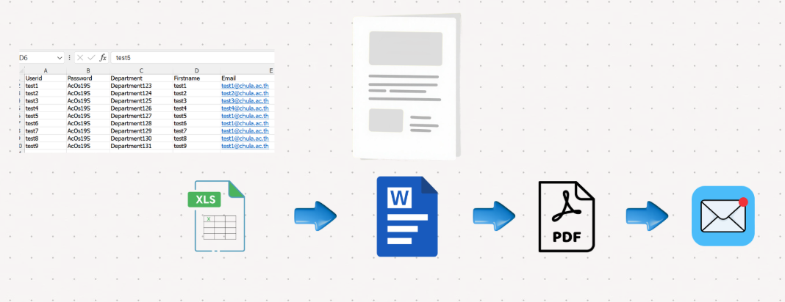

# Document Automation (Python)

## Overview
Automated document creation and email delivery using Python to reduce repetitive manual work.

## Problem
Manual document preparation required editing Word files, converting to PDF, and sending emails one by one, causing delays and errors.

## Solution
- Generate Word documents automatically from Excel data
- Convert Word files to PDF
- Send emails with attachments in batch

## Tools
Python, Excel, Microsoft Word, Email (SMTP)

## Result
- Reduced repetitive manual document work
- Faster document processing
- Improved accuracy and consistency

