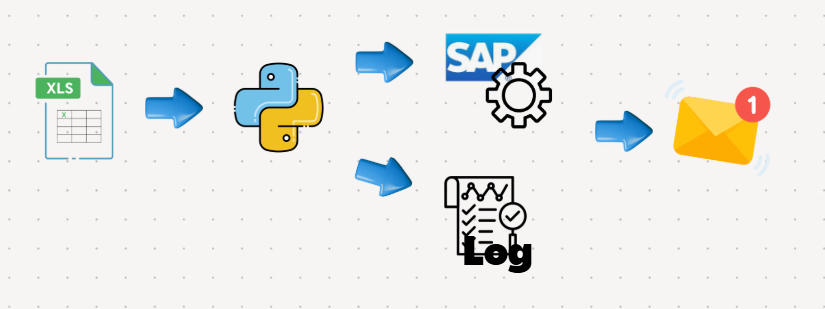

# HR RPA Automation Project (Python, SAP)

## Overview
This project automates HR data configuration into SAP using Python RPA,
reducing monthly manual workload.

โปรเจกต์นี้พัฒนาระบบอัตโนมัติสำหรับตั้งค่าข้อมูลพนักงานใน SAP โดยใช้ Python RPA  
เพื่อลดภาระงานที่ต้องทำด้วยมือในแต่ละเดือน

## Business Problem
HR functional teams manually processed employee data for:
- New hires
- Employee data updates
- Employee resignations

ทีม HR ต้องดำเนินการจัดการข้อมูลพนักงานด้วยตนเอง เช่น:
- พนักงานเข้าใหม่
- การแก้ไขข้อมูลพนักงาน
- การลาออกของพนักงาน

This process caused:
- High manual workload
- Risk of human error
- Delays in SAP configuration

## Objective
- Reduce manual HR configuration work
- Improve processing speed and accuracy
- Standardize HR data processing

- ลดงาน manual ของ HR
- เพิ่มความเร็วและความถูกต้องในการประมวลผล
- สร้างมาตรฐานในการจัดการข้อมูลพนักงาน

## Solution
A Python RPA solution was developed to:
- Read employee data from structured Excel files
- Validate and transform input data
- Automatically execute SAP configuration steps
- Log processing results for audit and review

พัฒนาโซลูชัน Python RPA ที่สามารถ:
- อ่านข้อมูลพนักงานจากไฟล์ Excel ที่มีโครงสร้าง
- ตรวจสอบและแปลงรูปแบบข้อมูล
- ดำเนินการตั้งค่าระบบ SAP อัตโนมัติ
- บันทึก Log สำหรับตรวจสอบย้อนหลัง

## Workflow
1. HR team prepares employee data in Excel
2. Python script validates and processes the data
3. RPA performs SAP configuration automatically
4. System generates logs for review

1. ทีม HR เตรียมข้อมูลพนักงานในไฟล์ Excel
2. Python script ตรวจสอบและประมวลผลข้อมูล
3. RPA ดำเนินการตั้งค่า SAP อัตโนมัติ
4. ระบบสร้าง Log สำหรับตรวจสอบผลลัพธ์

## Tools & Technologies
- Python
- SAP (RPA)
- Excel
- Windows OS

## Result
- Reduced monthly manual HR processing workload
- Improved data accuracy
- Faster HR operation turnaround time

## Role & Responsibility
- Analyzed HR business requirements
- Designed automation workflow
- Developed Python RPA scripts
- Coordinated with HR users for UAT testing

- วิเคราะห์ความต้องการทางธุรกิจของ HR
- ออกแบบ workflow ระบบอัตโนมัติ
- พัฒนา Python RPA script
- ประสานงานกับผู้ใช้ HR สำหรับ UAT Testing

## How to Run (Optional)
1. Install required Python libraries
2. Prepare input Excel file
3. Run the Python script by schedual task
4. Review log files for results

## Future Improvement
- Enhance error handling and reporting
- Extend automation to additional HR scenarios

