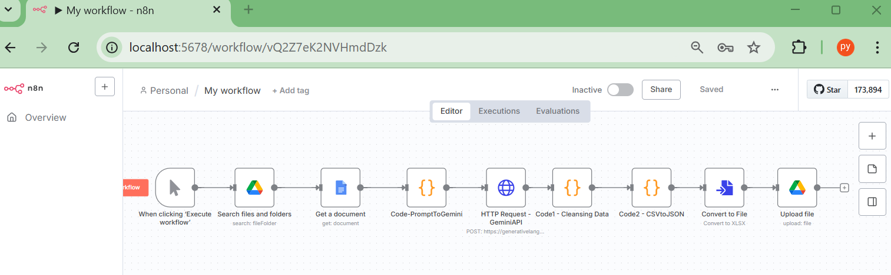
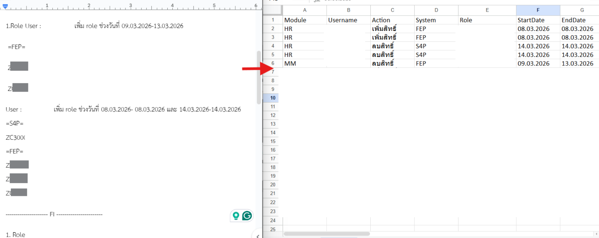

# n8n AI Data Automation (Unstructured → Structured)

## Overview
Automated workflow using n8n and AI to convert unstructured text into structured data tables, reducing manual data preparation.

โปรเจกต์นี้เป็นตัวอย่าง Workflow อัตโนมัติที่สร้างด้วย **n8n** และ **AI** สำหรับแปลงข้อมูลข้อความแบบไม่มีโครงสร้าง ข้อความบรรยายยาวๆ (Unstructured Text) ให้กลายเป็นตารางข้อมูลแบบมีโครงสร้าง (Structured Data) เพื่อลดเวลาการเตรียมข้อมูลแบบ Manual

## Problem
Role assignment data was provided in long unstructured text format.  
Manual data extraction and table creation were time-consuming and error-prone.

ข้อมูล Role Assignment ถูกส่งมาในรูปแบบข้อความยาว  
การดึงข้อมูลและสร้างตารางด้วยตนเองใช้เวลานานและมีโอกาสผิดพลาดสูง

## Solution
- Used n8n to create automated workflow
- Applied AI prompts to extract and structure data
- Performed data cleansing and formatting automatically
- Generated structured tables with one-click execution

- ใช้ n8n สร้าง Workflow อัตโนมัติ  
- ใช้ AI Prompt เพื่อช่วย Extract และจัดโครงสร้างข้อมูล  
- ทำ Data Cleansing และ Formatting อัตโนมัติ  
- สร้างตารางข้อมูล

## Tools
n8n, AI Prompt Engineering, Data Processing, Docker

## Result
- Reduced manual data preparation
- Improved data consistency and accuracy
- Enabled faster role assignment processing

# 📌 n8n Automation Workflow – File Search, AI Processing & Excel Export

Workflow นี้เป็นการใช้ **n8n** สำหรับสร้างระบบอัตโนมัติที่สามารถ

- ค้นหาไฟล์จาก Google Drive  
- ดึงข้อมูลเอกสารจาก word ที่เป็นข้อความบรรยาย  
- ใช้ AI วิเคราะห์และแปลงข้อมูล  
- ทำความสะอาดข้อมูล (Data Cleansing)  
- แปลงเป็น Excel (XLSX)  
- อัปโหลดไฟล์ รูปแบบตาราง กลับไปยัง Google Drive

---

## 🧩 Workflow Overview

ลำดับการทำงานของ Workflow (อ้างอิงตามภาพ)

1. **Trigger – Execute Workflow**  
   เริ่มต้น Workflow ด้วยการกด Execute ใน n8n

2. **Google Drive – Search files and folders**  
   ค้นหาไฟล์หรือโฟลเดอร์ใน Google Drive ตามเงื่อนไขที่กำหนด  
   (เช่น ชื่อไฟล์ หรือโฟลเดอร์เป้าหมาย)

3. **Google Docs – Get a document**  
   ดึงเนื้อหาจากเอกสาร Google Docs ที่ค้นหาได้ เพื่อนำไปประมวลผลต่อ

4. **Code – Prompt to Gemini (Gemini API)**  
   สร้าง Prompt และเตรียมข้อมูลจากเอกสาร เพื่อส่งไปให้ Gemini API วิเคราะห์

5. **HTTP Request – Gemini API**  
   เรียกใช้งาน Gemini API ผ่าน HTTP Request เพื่อรับผลลัพธ์จาก AI

6. **Code1 – Data Cleansing**  
   ทำความสะอาดข้อมูล (Data Cleansing) เช่น  
   - ลบข้อมูลที่ไม่จำเป็น  
   - ปรับรูปแบบข้อมูลให้เป็นมาตรฐาน  
   - เตรียมข้อมูลให้อยู่ในรูปแบบที่พร้อมใช้งาน

7. **Code2 – CSV to JSON**  
   แปลงข้อมูลจากรูปแบบ CSV เป็น JSON เพื่อให้ง่ายต่อการนำไปสร้างไฟล์หรือประมวลผลต่อ

8. **Convert to File – Convert to XLSX**  
   แปลงข้อมูล JSON เป็นไฟล์ Excel (XLSX)

9. **Google Drive – Upload file**  
   อัปโหลดไฟล์ Excel ที่สร้างเสร็จแล้วกลับไปยัง Google Drive โดยอัตโนมัติ

---

## 🛠️ Tools & Technologies

- **n8n** – Workflow Automation  
- **Google Drive API** – ค้นหาและอัปโหลดไฟล์  
- **Google Docs API** – ดึงข้อมูลเอกสาร  
- **Gemini API (Generative AI)** – วิเคราะห์และแปลงข้อมูลด้วย AI  
- **Excel (XLSX)** – รูปแบบไฟล์ผลลัพธ์

---

## 🎯 Use Cases

- แปลงข้อมูลจากเอกสารข้อความยาวให้เป็นตารางข้อมูลแบบอัตโนมัติ  
- ลดงาน Manual เช่น Copy / Paste ข้อมูลลง Excel  
- ใช้ AI ช่วยจัดโครงสร้างข้อมูล (Structured Data)  
- เตรียมข้อมูลสำหรับ Reporting หรือ Data Analysis

---

## 🚀 How to Use

1. Import Workflow นี้เข้าไปใน n8n  
2. ตั้งค่า Credentials  
   - Google Drive  
   - Google Docs  
   - Gemini API  
3. กด Execute Workflow เพื่อทดสอบการทำงาน

---

✨ **This project demonstrates how AI + Automation can significantly reduce manual data processing work.**