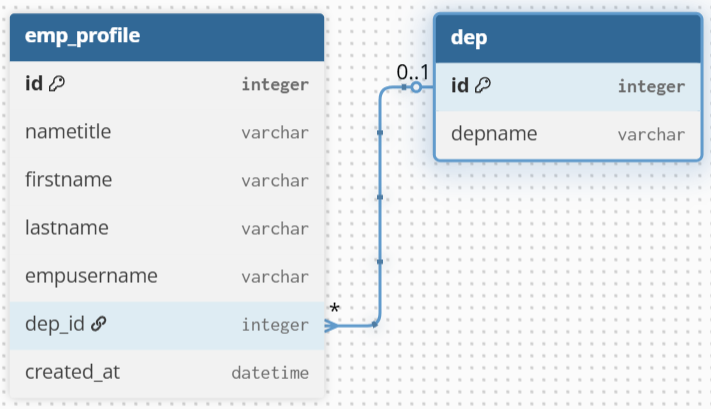

# Employee Database Management (MySQL)

## Overview
Designed and implemented a MySQL database to manage employee information.

## Problem
Employee data was stored across multiple files and formats, making it difficult to manage, update, and ensure data consistency.

## Solution
- Designed a relational database schema for employee management
- Implemented MySQL tables with proper relationships
- Applied data normalization to reduce redundancy
- Enabled efficient querying and data maintenance

## Tools
MySQL, SQL

## Result
- Centralized employee data management
- Improved data consistency and integrity
- Simplified employee data retrieval and updates

# Employee Database Management (MySQL)

## Database Design


*ER diagram showing normalized tables and relationships for employee data management.*

## Key Tables
- emp_profile
- emp_contact
- dep
- emp_groupuser
- profile_groupuser

## 🔗 Database Relationships

### 🔹 One-to-One: Employee Profile & Contact
Employee Profile & Contact Information

Tables
- emp_profile – stores core employee information
- emp_contact – stores employee contact details

Each employee profile has exactly one contact record.


T
---

### 🔹 One-to-Many: Department & Employee
Tables
- dep – department information
- emp_profile – employee profile

One department can have multiple employees,
but each employee belongs to only one department.



---

### 🔹 Many-to-Many: Employee & Group
Tables
- emp_profile
- emp_groupuser
- profile_groupuser (junction table)
สร้าง joint table มา 1 table เพื่อเชื่อมต่อ จะได้ one to many 2 ตาราง


Employees can belong to multiple groups,
and each group can contain multiple employees.

## 🔹สร้าง Foreign key
สร้าง Foreign key แบบ Casecade - เมื่อ PK ถูกลบ FK จะถูกลบด้วย

Foreign key แบบ SET NULL - เมื่อ PK ถูกลบ FK จะเป็น Null

Foreign key แบบ RESTRICT - PK จะไม่ถูกลบเมื่อมี FK ห้อยตามอยู่


# SQL Sample Queries – Employee Management System

This repository contains sample SQL queries demonstrating how to retrieve and analyze data from an Employee Management System database.

The examples focus on:
- Table relationships (JOIN)
- Aggregation and grouping
- Real-world employee and department use cases

---

## 🔹 Query 1: Employee & Department

**โจทย์:**  
แสดงข้อมูลพนักงาน (Employee) และแผนก (Department)

```sql
SELECT 
    p.empusername,
    d.depname,
    d.dep_id
FROM emp_profile p
JOIN dep d
    ON p.dep_id = d.id;

